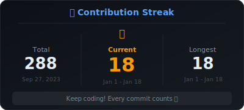
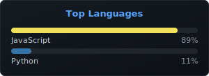
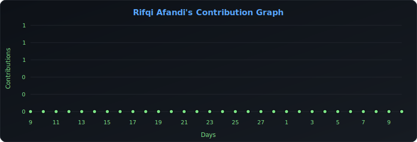

<h1 align="center">Hey 👋What's Up?</h1>

###

<h3 align="center">I'm Rifqi Afandi</h3>

  A passionate <strong>Full Stack Developer</strong> who loves building web applications and exploring new technologies. I enjoy turning ideas into reality through clean, efficient code and creating seamless user experiences.

  🔭 I'm currently working on <strong>Web Development Projects</strong> 
  🌱 I'm continuously learning and improving my skills in <strong>React, Node.js, and Python</strong> 
  🤖 I leverage <strong>AI tools</strong> to boost productivity and accelerate development workflows 
  💬 Ask me about <strong>JavaScript, Frontend Development, and Backend APIs</strong> 

###

 

  
  
  
  
  
  
  
  
  
  
  
  
  
  
  
  
  
  
  

###

  
  
  
  

###

<!-- GitHub Stats - Auto Generated -->

  
  

###

  

###

  

###

<!-- Last updated: 2026-02-06T06:50:23.240Z -->
